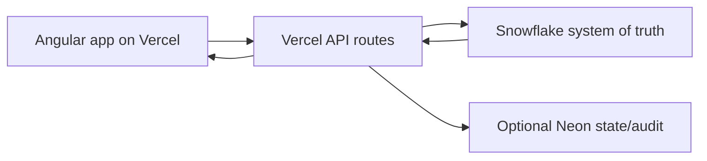

# Compliance Lab Angular

Angular/Vercel rebuild of the Streamlit hub application.

Snowflake remains the system of truth. The API reads Snowflake directly by default; Neon Postgres is optional for app-owned cache, audit, and workflow state.

## Stack

- Angular `21.2.x` app shell
- Vercel static Angular hosting plus Node.js 22 serverless API routes
- Snowflake Node SDK for source reads and Open Stock write-back
- Neon Postgres dedicated schema for cached hub rows, sync runs, feedback, and audit logs
- GitHub Actions CI for install, typecheck, and production build

Angular `21.2.12` was the latest stable Angular release found while scaffolding this on May 12, 2026. The package ranges use `^21.2.0` so npm resolves the newest stable patch in that line.

## Architecture



The Vercel API reads Snowflake views/tables live unless `HUB_QUERY_MODE=neon` is explicitly set. Open Stock edits call `/api/open-stock/changes`, which writes to Snowflake and records the Snowflake batch/cell audit tables.

## Environment

Copy `.env.example` to `.env.local` for local work and configure the same values in Vercel project environment variables.

Optional for Neon:

- `DATABASE_URL`
- `NEON_SCHEMA`, default `open_stock_hub`

Required for backend Snowflake reads/write-back:

- `SNOWFLAKE_ACCOUNT`
- `SNOWFLAKE_USERNAME`
- `SNOWFLAKE_WAREHOUSE`
- `SNOWFLAKE_DATABASE`
- `SNOWFLAKE_SCHEMA`
- `SNOWFLAKE_ROLE`, if required

Set one backend auth method:

- `SNOWFLAKE_PASSWORD`
- `SNOWFLAKE_PRIVATE_KEY`, `SNOWFLAKE_PRIVATE_KEY_BASE64`, or `SNOWFLAKE_PRIVATE_KEY_PATH`
- `SNOWFLAKE_AUTHENTICATOR=OAUTH` plus `SNOWFLAKE_OAUTH_TOKEN`

`SNOWFLAKE_AUTHENTICATOR=EXTERNALBROWSER` is supported for local developer testing only; hosted backend deployments should use a server-held credential, key pair, or OAuth token.

Sync protection:

- `SYNC_API_KEY` protects `/api/sync/:hub`
- `ALLOW_UI_SYNC=true` allows browser-triggered sync only when the app is private and no `SYNC_API_KEY` is set

Optional OIDC authentication:

- `AUTH_REQUIRED=true` forces bearer-token auth on browser API routes in both Vercel and the local Python preview.
- `OIDC_AUTHORITY`, `OIDC_CLIENT_ID`, and `OIDC_CLIENT_SECRET` enable authorization-code login.
- `OIDC_AUTHORIZE_URL` can point login to a different authorize endpoint; by default the app uses `OIDC_AUTHORITY + /authorize`, matching the existing Angular flow.
- `OIDC_REDIRECT_URI` should match the deployed app origin, for example `https://YOUR_APP.vercel.app`; local preview defaults to `http://localhost:4200`.
- `OIDC_LOCAL_REDIRECT_URI` can override the local callback without changing the Vercel callback.
- `OIDC_TOKEN_PATH`, default `/token`, and `OIDC_PROFILE_PATH`, default `/profile`, mirror the existing OMS/OIDC endpoints.
- `OIDC_LOGOUT_URL` controls sign-out redirect. The app appends `?service=<origin>`.

## Neon Schema

Apply the dedicated schema after dependencies are installed:

```bash
npm run db:migrate
```

The migration creates:

- `hub_rows`
- `hub_sync_runs`
- `openstock_change_batches`
- `openstock_change_log`
- `manual_overrides`
- `account_history`
- `feedback`

## Development

```bash
npm install
npm run db:migrate
npm run dev
```

This workspace also includes a no-npm local preview server for SSO testing. It serves `preview.html` and the `/api/...` routes on port `4200` using the installed Python Snowflake connector:

```powershell
C:\Users\cooli\AppData\Local\Programs\Python\Python312\python.exe scripts\local_preview_server.py
```

With `SNOWFLAKE_AUTHENTICATOR=EXTERNALBROWSER`, the first data request opens the official browser SSO/SAML flow and then reuses that backend connection.

The Angular dev server runs the frontend. For local API emulation with the Node routes, use Vercel CLI once installed:

```bash
npm install -g vercel
vercel dev
```

## Sync Examples

With a sync key:

```bash
curl -X POST "https://YOUR_APP.vercel.app/api/sync/open-stock?runDate=20260512" \
  -H "x-sync-key: $SYNC_API_KEY"
```

Other hub keys:

- `autoshipments`
- `conversions`
- `dc-matrix`
- `itrade`
- `off-mog`
- `open-stock`
- `prop-list`
- `slow-dead`
- `substitutions`
- `unlocked-accounts`

## Deploy

Vercel configuration is in `vercel.json`:

- build command: `npm run build`
- output directory: `dist/compliance-lab/browser`
- API runtime: Node.js 24
- SPA rewrites for Angular routes

Once the repo is connected to GitHub, Vercel Git integration will create previews for branches and production deployments from the production branch.

## Notes From The Streamlit Port

The first pass keeps the hub model from the Streamlit app:

- Open Stock has editable worklist, metrics, action list, CSV export, feedback, and Snowflake write-back endpoint.
- Other hubs are wired as cached Snowflake sources with shared filtering/search/export UI.
- The Neon schema is intentionally JSONB-first because the Snowflake views have many wide, evolving columns.

Next hardening steps are auth/role mapping, richer bulk import validation, Excel export generation, and scheduled sync jobs.
